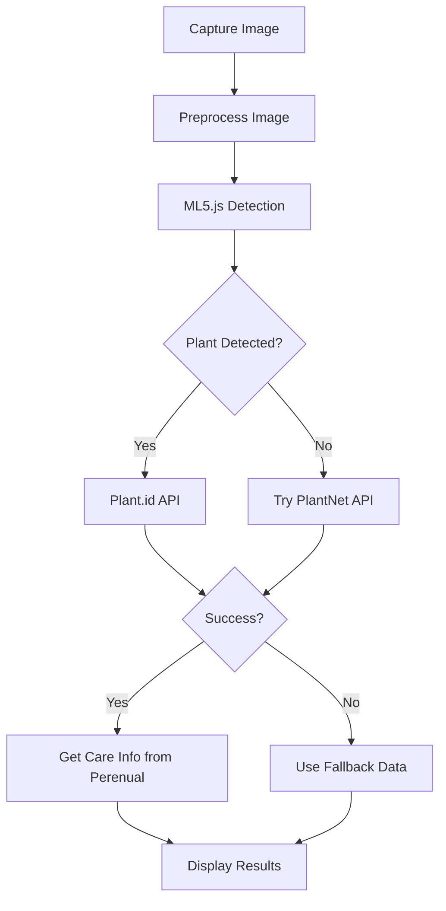

# Plant Detection API Setup Guide

This guide will help you set up the enhanced plant detection system with multiple API providers for better accuracy and comprehensive plant information.

## 🚀 Quick Start

1. **Copy the environment template:**
   ```bash
   cp .env.example .env
   ```

2. **Add your API keys to `.env`:**
   ```env
   # Plant.id API - Most accurate plant identification
   REACT_APP_PLANT_ID_API_KEY=your_plant_id_api_key_here
   
   # Perenual API - Plant care information
   REACT_APP_PERENUAL_API_KEY=your_perenual_api_key_here
   
   # PlantNet API - Open source plant identification
   REACT_APP_PLANTNET_API_KEY=your_plantnet_api_key_here
   
   # Trefle API - Legacy plant database (optional)
   REACT_APP_TREFLE_TOKEN=your_trefle_token_here
   ```

3. **Install dependencies and start:**
   ```bash
   npm install
   npm start
   ```

## 🔑 API Providers

### 1. Plant.id API (Recommended - Most Accurate)
- **Website:** https://web.plant.id/
- **Features:** 
  - Highest accuracy plant identification
  - Health assessment
  - Disease detection
  - Detailed plant information
- **Pricing:** Free tier available, paid plans for higher usage
- **Setup:**
  1. Create account at https://web.plant.id/
  2. Get your API key from the dashboard
  3. Add to `.env` as `REACT_APP_PLANT_ID_API_KEY`

### 2. Perenual API (Plant Care Information)
- **Website:** https://perenual.com/docs/api
- **Features:**
  - Comprehensive plant care guides
  - Growth information
  - Hardiness zones
  - Maintenance requirements
- **Pricing:** Free tier with 100 requests/day
- **Setup:**
  1. Register at https://perenual.com/docs/api
  2. Get your API key
  3. Add to `.env` as `REACT_APP_PERENUAL_API_KEY`

### 3. PlantNet API (Open Source)
- **Website:** https://my.plantnet.org/
- **Features:**
  - Open source plant identification
  - Collaborative database
  - Scientific accuracy
- **Pricing:** Free with registration
- **Setup:**
  1. Create account at https://my.plantnet.org/
  2. Generate API key
  3. Add to `.env` as `REACT_APP_PLANTNET_API_KEY`

### 4. Trefle API (Legacy - Optional)
- **Website:** https://trefle.io/
- **Features:** 
  - Large plant database
  - Basic plant information
- **Note:** This API has limitations and is used as a fallback
- **Setup:**
  1. Register at https://trefle.io/
  2. Get your token
  3. Add to `.env` as `REACT_APP_TREFLE_TOKEN`

## 🔧 Enhanced Features

### Multi-Model AI Detection
- **MobileNet:** Fast general-purpose classification
- **DenseNet:** More accurate for complex images
- **Plant-specific filtering:** Prioritizes plant-related results

### Image Preprocessing
- **Green channel enhancement:** Improves plant detection
- **Noise reduction:** Cleaner image analysis
- **Standardized sizing:** Optimal model input

### Fallback System
- **Multiple API attempts:** If one fails, tries others
- **Offline plant database:** Works without internet
- **Graceful degradation:** Always provides some information

### Enhanced UI
- **Loading states:** Shows progress during analysis
- **Confidence indicators:** Displays detection accuracy
- **Source attribution:** Shows which API provided data
- **Comprehensive plant info:** Care guides, taxonomy, uses

## 📊 Detection Flow



## 🎯 Usage Tips

### For Best Results:
1. **Good lighting:** Natural light works best
2. **Clear focus:** Ensure the plant is in sharp focus
3. **Distinctive features:** Include leaves, flowers, or unique characteristics
4. **Close-up shots:** Fill the frame with the plant
5. **Multiple angles:** Try different perspectives if first attempt fails

### Troubleshooting:
- **Low confidence:** Try a different angle or better lighting
- **No detection:** Ensure the image clearly shows plant features
- **API errors:** Check your API keys and internet connection
- **Slow performance:** Some APIs may have rate limits

## 🔒 Privacy & Security

- **Local processing:** ML5.js runs in your browser
- **Secure API calls:** All requests use HTTPS
- **No data storage:** Images are not permanently stored
- **API key protection:** Keep your `.env` file secure

## 🚀 Performance Optimization

### Image Quality:
- **Resolution:** 224x224 pixels optimal for ML models
- **Format:** JPEG recommended for smaller file sizes
- **Compression:** Balance quality vs. upload speed

### API Usage:
- **Caching:** Results are cached for 24 hours
- **Rate limiting:** Respects API provider limits
- **Fallback order:** Most accurate APIs tried first

## 📈 Future Enhancements

### Planned Features:
- [ ] Custom plant model training
- [ ] Plant disease detection
- [ ] Growth tracking over time
- [ ] Community plant database
- [ ] Offline-first architecture
- [ ] Plant care reminders
- [ ] Integration with garden planning tools

### Contributing:
1. Fork the repository
2. Create a feature branch
3. Add your enhancements
4. Submit a pull request

## 📞 Support

If you encounter issues:
1. Check the console for error messages
2. Verify your API keys are correct
3. Ensure you have internet connectivity
4. Try with different plant images
5. Check API provider status pages

For additional help, please open an issue on GitHub with:
- Error messages
- Browser console logs
- Steps to reproduce
- Example images (if possible)

---

**Happy Plant Identifying! 🌱**
